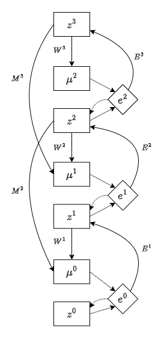

# Neural Generative Coding (NGC)

Implementing the GNCN-PDH model from https://www.nature.com/articles/s41467-022-29632-7. Some of the definitions don't quite match the paper, but they do match the ngc-learn code and documentation.

There's three types of nodes:

 - Latent state neurons $z^1, \ldots, z^L$ (also $z^0$ is a special neuron that is always clamped to an input example)
 - Stateless prediction neurons $\mu^0, \ldots, \mu^{L-1}$
 - Stateless error neurons $e^0, \ldots, e^{L-1}$

Each prediction $\mu^\ell$ is taken to be the estimated mean of the probability distribution of $z^\ell$, where the prediction is made by the 1-2 latent state nodes above it via the equation:

$$\mu^\ell = g^\ell[W^{\ell+1} \phi^{\ell+1}(z^{\ell+1}) + \alpha_m (M^{\ell+2} \phi^{\ell+2}(z^{\ell+2}))]$$

where:

 - $W^1, \ldots, W^L$ are learnable, top-down "forward/generative" weight matrices
 - $\phi^\ell$ is the activation function for layer $\ell = 1, \ldots, L$
    - in the code implementation, $\phi^\ell = \text{ReLU}$ for all layers $\ell$
 - $g^\ell$ is the activation function for $\mu^\ell$
    - in the code implementation, $g^\ell = \text{ReLU}$ for $\ell = 1, \ldots, L-1$, and $g^0 = \text{sigmoid}$
 - $\alpha_m = 0 \text{ or } 1$ is a binary parameter that determines whether "skip connections" are used for top-down predictions
    - when $\alpha_m = 1$, the model is called GNCN-PDH (short for GNCN-t2-LΣ-PDH. "PDH" = "Partially Decomposable Hierarchy"). When $\alpha_m = 0$, they call it GNCN-t2-LΣ
 - $M^2, \ldots, M^L$ are learnable weight matrices used when $\alpha_m = 1$

The connectivity diagram for GNCN-PDH is shown below. Dotted lines represent a simple copy, while solid lines indicate a transformation by weight matrix. The weight matrix connections are also normalized to magnitude 1 after each update.

The error at each layer is $\ell$ is given by a simple difference:

$$e^\ell = z^\ell - \mu^\ell$$

While the local loss at layer $\ell = 0, \ldots, L-1$ is:

$$\mathcal{L}^\ell = \| e^\ell \|_2^2$$

(that's supposed to be a norm, but GitHub's LaTeX support is broken). Thus the network seeks to minimize the total discrepancy

$$\mathcal{L} = \sum_{\ell=0}^{L-1} \mathcal{L}^\ell$$

However, unlike with backprop-based schemes, in NGC, learning at each layer aims to minimize a local loss function, rather than a global one.
